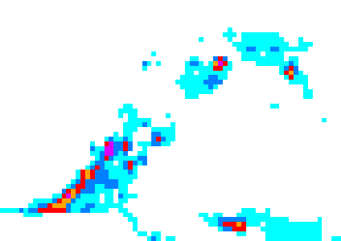
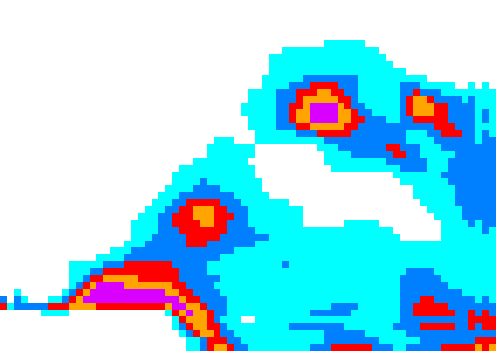
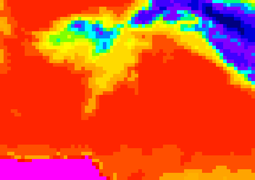
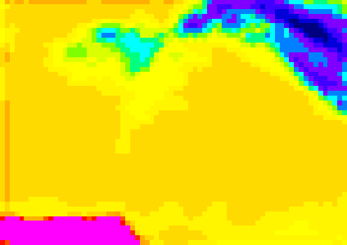
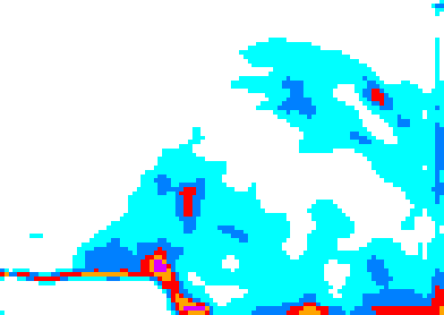
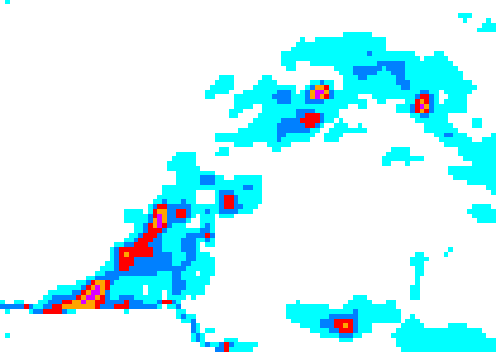

# **DeepLearning for Short-Range Weather Forecasts**
Weather forecasting is a long-studied field. Numerical Weather Prediction (NWP) models have been around since revolution in high performance computing. NWP, refers to forecasting the future state of the weather through large computer simulations that take into account the current states of variables. This method uses Partial Differential Equations to predict the temperature, wind, precipitation, and clouds. 

The motivation behind this project is to propose a different **Deep Learning model** to not only forecast precipitation, but also temperature as well as additional land, oceanic and atmospheric climate variables, so that **less computing power is used**, and **the predictions are more accurate**.

## **Dataset Construction**
To train our model, we went ahead and created our own dataset. We used the Google Earth Engine (GEE) to get the precipitation and temperature hourly aggregates as images, in which each pixel covers ~11KM on ground. Following are some samples of temperature and precipitation dataset: 

  
  

### Region Coordinates
- 23.155933,59.545898,37.439499,79.541016

  

### Preprocessing
We have resized the dataset images into two resolutions for different models
1. 74 x 104
2. 54 x 74

Our GEE script downloads the images with a matplotlib axis padding, So we have written a script to crop the images as well.

Lastly, We have concatenated the images into numpy arrays such that 24 hours correspond to 24 images. For example, a sample of one month will have a 4 dimensional tensor of 30 x 24 x width x height. If we were to concatenate daily aggregates of precipitation and temperature, then our samples would like the following gifs:

  
  

## **Architecture**
Inspired by Xingjian Shi et al., 2015, We have used ConvLSTMs for our model.

  

## **Dependencies**
- tensorflow
- ee
- geemap
- numpy
- matplotlib
- opencv
- moviepy
- imageio
- pandas
 

## **Training-Results**
We have implemented our models in TensorFlow. We have trained four different models and on different configurations, using Adam optimizer with the loss suggested from paper.

Model|Type|Ground Truth | Predictions |Comments|
|----|----|-------------|-------------|---|
|1.|Precipitation|||Model 1 captures the dynamics of the motion but the amount of prediction precipitation is high.
|2.|Temperature|||Model 2 is trained on the temperature data, and it captures both the motion and predictions are aligned with the ground truth.
|3.|Precipitation|||Model 3 improves over Model 1 and performs better.|
|4.|Precipitation|||Model 4 has successfully captured the motion as well as the amount of precipitation occuring in different regions.

## **Wind Speed**
For the wind speed we have made some changes to the model by adding dropout and l2 regularization, as the model was overfitting. These changes improved model's performance. We trained our model on U and V components of the Wind, and also on hourly data as well as daily averages since 1940. We have kept the region coordinates same as above.

### **Results for the Wind Speed and Direction**

  
  

## **Final Results on Folium Map for Precipitation and Temperature**

  
  

#### **Note: We have kept the scripts and the model hidden until we have completed the entire project and deployed it.**